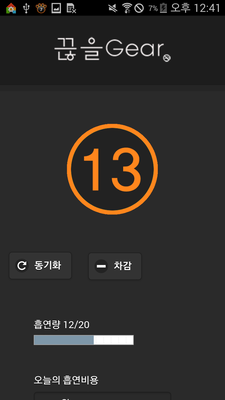
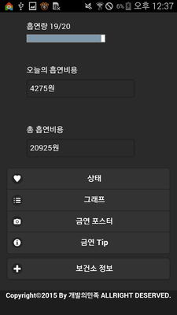
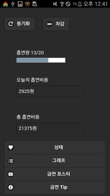
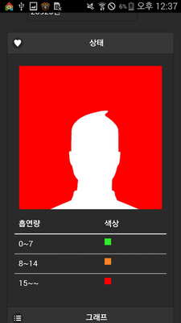
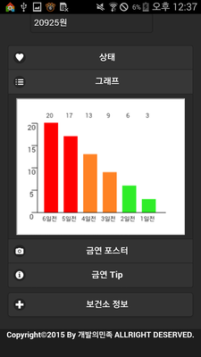
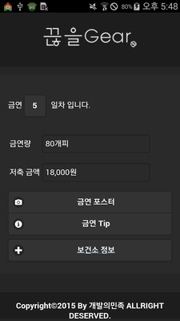
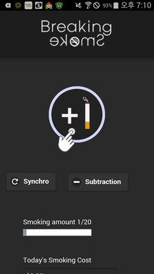
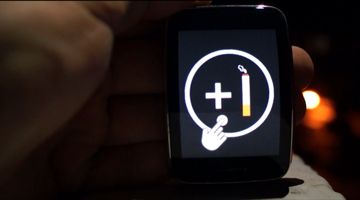
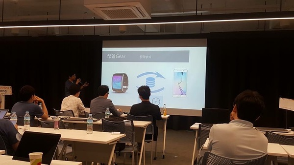

# 끊을기어 
* 갤럭시기어와 연동되는 금연도우미 안드로이드 웹앱

## 개요
2015년 11월 한국IT전문학교 교내 프로젝트 대회에서 최우수상을 수상한 안드로이드 금연도우미 앱입니다. 
웨어러블 기기와 연동하여 흡연 시 버튼을 눌러 간편하게 흡연량을 관리할 수 있습니다. 
기존 앱은 흡연 후 직접 앱을 열어 관리해야 하는 불편함이 있었지만, 
이 앱은 웨어러블 기기의 버튼을 한 두 번만 눌러서 흡연기록을 관리할 수 있어 사용자 편의성을 높였습니다.

## 구현 기능
- 소셜 로그인 기능(네이버)
- 웨어러블 기기(갤럭시 워치)와 안드로이드 연동
- 일간 흡연량 및 흡연 비용 표시
- 주간 흡연량 대비 위험도 및 그래프 표시
- 금연 장려 포스터, TIP, 근처 보건소 표시
- 영문버젼

## 사용한 기술스택
- 안드로이드 어플: Java, JavaScript(JQuery)
- 웨어러블 어플: TizenOS(Java)
- DBMS: MySql

## 이미지

< 해커톤 대회 발표 사진 >
